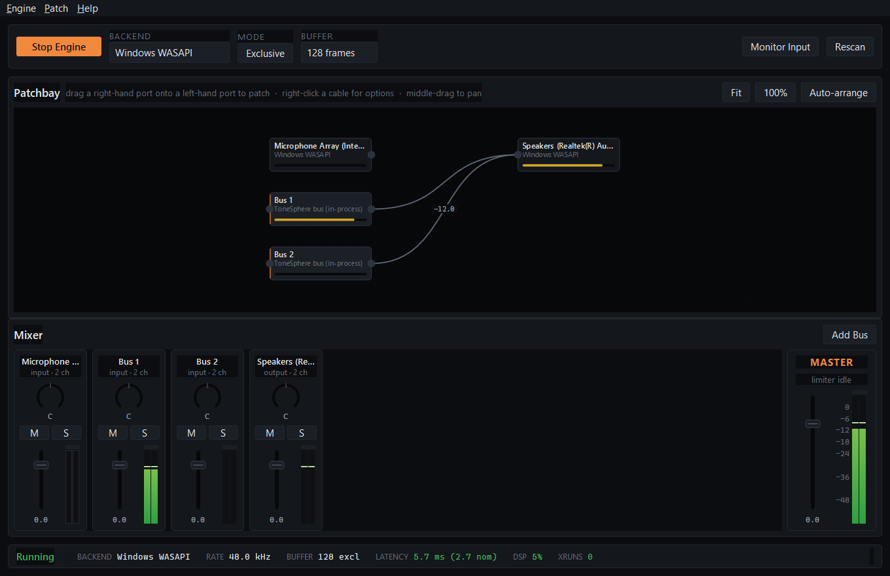

# Tone Sphere


Low-latency audio routing and mixing for Windows, Linux and macOS.
**5.7 ms measured round trip** at a 128-frame buffer on WASAPI exclusive, ~5% DSP load.

[](https://github.com/AvishakeAdhikary/tone-sphere/releases/latest)
[](LICENSE)
[](https://github.com/sponsors/avishakeadhikary)
[](https://www.patreon.com/avishakeadhikary)
[](https://ko-fi.com/avishakeadhikary)
[](https://www.buymeacoffee.com/avishake69)



This is not your usual readme.

I am a guitarist, and I recently bought an audio interface, only to find out that playing or recording guitar requires me to pay again.
Honestly it was all cool and all, but I use Guitar Rig, which already is an expensive piece of software, not to mention the guitar itself is expensive enough, now I have a microphone and an audio interface.
But then comes the audio software bs that comes with it.
I was bored and frustated. I tried both Voicemeeter and Odeus Asio Link Pro.
Voicemeeter ran great, until it asked me to donate again and again, it felt a lot intrusive. I mean, why would I wait for 5 minutes if it is a donationware? Ffs it's donation ware, you either ask nicely or leave, not make people wait.
When I still waited, it became high latency out of nowhere. With VB audio cable of course.
Then I tried odeus asio link pro with asio. And honestly bro, wtf. That stuff was ancient and still no alternative to the date, it was an absolute chad.
But tbh I didn't like the approach, it was too complicated for beginners to grasp, to steep of a curve to just plug your guitar in to your audio interface and start playing.
I've had enough, so being a coder myself, I coded one on my own.

This project is all about that.

## Setup

```
pip install uv        # if you don't have it
uv sync
uv run main.py gui
```

**Linux only:** the `sounddevice` package is a thin ctypes wrapper — unlike the
Windows/macOS wheels, the Linux wheel does not bundle PortAudio's shared library. Install
it from your distro first, or every audio feature reports `PortAudio library not found`:

```
sudo apt install libportaudio2      # Debian/Ubuntu
sudo dnf install portaudio          # Fedora
sudo pacman -S portaudio            # Arch
```

Check what your machine can do first:

```
uv run main.py test
```

That reports PASS/WARN/FAIL per capability, plays a test tone through your default output,
and exits non-zero if anything is broken. On this machine:

```
[INFO] Active backend:   Windows WASAPI
[PASS] Stream open on Speakers (Realtek(R) Audio)
[PASS] No callback errors
[PASS] No dropouts (xruns)
[INFO] Measured latency: 5.7 ms round trip
[INFO] Nominal latency:  2.7 ms (buffer arithmetic only)
[INFO] DSP load:         5.1%
```

## What works

**Audio path.** One PortAudio stream per device, mixing inside the driver's own callback.
A device used in both directions gets a single duplex stream, so input and output share one
clock and cannot drift — that is the guitar path, and the lowest-latency configuration
available. Cross-device routes pass through lock-free ring buffers with drift correction.

**Backends.** WASAPI (shared and exclusive), WDM-KS, DirectSound, MME on Windows; ALSA and
JACK on Linux; CoreAudio on macOS. Exclusive mode is tried first and falls back to shared
per device when refused, telling you which it got.

Measured on one machine, same hardware, same test:

| Backend | Round trip | vs. nominal |
|---|---|---|
| WASAPI exclusive | **8.3 ms** | 5.3 ms |
| WDM-KS | 17.0 ms | 5.3 ms |
| WASAPI shared | 22.0 ms | 5.3 ms |
| MME | 96.0 ms | 5.3 ms |
| DirectSound | 120.0 ms | 5.3 ms |

That table is why ToneSphere always shows measured latency next to the nominal figure.
Nominal is buffer ÷ sample rate — arithmetic about our own contribution, and off by up to
20× from what you actually hear.

**Mixing.** Constant-power pan, polarity invert, per-channel trim/mute/solo, channel swap,
gain smoothing on everything so nothing clicks, and a limiter on each output so a routing
mistake sounds like a compressed mix rather than a burst of digital noise.

**Effects.** Biquad EQ (peaking, shelves, high/low pass), a compressor with real attack,
release, knee and makeup, and a delay with feedback.

**VST3 / AU plugins.** Load Guitar Rig, Neural DSP or anything else you own directly onto a
channel and monitor through it. Plugin latency is added to the reported round trip.

**Patchbay.** Drag a port to a port to connect. Feedback loops are refused before they
happen. Cables show their gain; muted and broken routes look different.

**Presets.** Patch and mixer state saved as plain YAML, keyed on device names rather than
indices, so they survive plugging something in. Partial recall: a preset saved with an
interface attached loads without it and tells you what was missing.

**Settings.** Stored in SQLite under your user data directory —
`%LOCALAPPDATA%\Neural Nexus Studios\ToneSphere\settings.db` on Windows,
`$XDG_DATA_HOME/ToneSphere` (or `~/.local/share/ToneSphere`) on Linux,
`~/Library/Application Support/ToneSphere` on macOS. Not next to the executable: the Store
build is an MSIX package whose install directory is read-only, and the GUI and the API
server are expected to be open at once, which one YAML file cannot survive. An
`audio_engine_config.yaml` left over from an earlier version is imported once, on first
run, and left where it is. `config/default_config.yaml` holds the defaults, and every key
in it is read by something.

**Network streaming, both directions.** A realtime UDP transport with a 30-byte binary
header, sequence numbers and a jitter buffer that reorders, conceals and paces playout, on
top of the existing TCP path for bulk transfer. Sending was previously a stub that logged a
warning; it is now a real routing-matrix destination, so it survives the patchbay being
edited underneath it. Proved by a test that puts a 1 kHz sine into a bus on one engine and
reads the same samples back out of a bus on another over localhost UDP.

**Per-application capture, on Windows.** Capture one process's audio by PID —
`ActivateAudioInterfaceAsync` with `VIRTUAL_AUDIO_DEVICE_PROCESS_LOOPBACK`, Windows 10 build
20348+, no driver and no virtual cable. Proved by capturing ToneSphere's own process while
it plays a known 1 kHz tone and measuring the frequency and sample rate that come back.

**A Linux sink other applications can select.** A `pactl`-created null sink, bridged into
PortAudio through an ALSA `pulse` PCM, so routing into it is an ordinary output stream — no
new IPC. Labelled honestly as an OS-visible endpoint, distinct from the in-process buses.

**Also:** system-wide loopback capture, real audio-session detection (which applications
are actually playing), a REST API with a WebSocket stats feed, and a CLI.

## What does not work yet

- **Virtual devices other applications can select, on Windows.** The buses are in-process
  summing points; nothing outside ToneSphere can see them. On Windows that needs a signed
  kernel driver — [docs/VIRTUAL_AUDIO_DRIVER.md](docs/VIRTUAL_AUDIO_DRIVER.md) covers
  exactly what and how much. It is the one deliberately-undone item here.
- **The macOS virtual device, in day-to-day use.** There is now a real CoreAudio HAL
  plug-in in [native/coreaudio-plugin/](native/coreaudio-plugin/) that publishes a
  **ToneSphere Audio** loopback device. It **builds, installs, and round-trips audio in
  the macOS CI job** — a 1 kHz sine written to the device and captured back from it, with
  the frequency and RMS asserted. That is the whole of the evidence. Day-to-day
  device-picker behaviour — System Settings and Audio MIDI Setup, selecting it in
  Discord/OBS/a DAW, sleep/wake, Gatekeeper on a real user's own install method — is
  **unverified**, and the plug-in's C was written on a Windows machine by someone who
  could not compile or listen to it. Treat it as "proven in CI, unproven in life".
- **ASIO.** Not in the PyPI PortAudio build — Steinberg's SDK cannot be redistributed. It
  appears automatically if you supply a PortAudio built against it. WASAPI exclusive is
  within a few ms anyway.
- **Opus compression for network audio.** The UDP transport carries PCM — float32 or int16,
  optionally zlib'd — and reserves a codec id for Opus that both encode and decode refuse
  rather than quietly substituting PCM for. The blocker is packaging, not the codec: PyOgg
  publishes Windows-only wheels (and its released version exposes no encoder class at all),
  and `opuslib` publishes no wheels, so either one needs a system libopus installed per
  platform. A codec path testable on one of the three platforms in CI is not one this
  project will claim.
- **TCP send.** The TCP path still only receives; its send side refuses with a message
  saying so. UDP is the wired direction, and the right one for monitoring anyway.
- **Adaptive jitter buffering.** The buffer's target latency is one fixed, exposed setting
  (40 ms by default). Estimating it from measured jitter is a real improvement and is
  deliberately deferred, because an adaptive control loop in the audio path without a
  deterministic test for it is worse than a slightly conservative constant.

## Roadmap

| Phase | | |
|---|---|---|
| 0 | Remove false claims, delete dead code, add tests and CI | done |
| 1 | Real audio I/O: PortAudio callback, lock-free graph, real enumeration | done |
| 2 | Real mixer: pan law, polarity, limiter, drift resampling, metering | done |
| 3 | Qt interface: mixer strips, dB faders, node-graph patchbay | done |
| 4 | VST3 hosting, real DSP, honest app detection, presets | done |
| 5 | Packaging (CI-built and smoke-tested, releases on tag); per-process capture (Windows, done); virtual devices (Linux done; macOS proven in CI, unverified in daily use; Windows kernel driver deliberately not attempted — see [docs/VIRTUAL_AUDIO_DRIVER.md](docs/VIRTUAL_AUDIO_DRIVER.md)); Microsoft Store MSIX — manifest, logo generation and a local pack script exist and the manifest validates against the real `makeappx`, but nothing has been signed, installed from a package, or submitted, and the Store identity does not exist yet (see [docs/MICROSOFT_STORE.md](docs/MICROSOFT_STORE.md)) | mostly done |

## A note on how this was rebuilt

An earlier version of this README advertised ASIO, WASAPI, ALSA, PulseAudio, JACK, PipeWire
and CoreAudio support, virtual audio devices, real-time effects and low-latency processing.
None of it worked. The eight driver classes each returned an array of zeros instead of
talking to an audio API; the "virtual audio devices" were Python queues; routing reported
success into an empty registry; and the UI displayed `CPU: 0% | Latency: 0ms` permanently,
which was not a reading of anything.

So there is one rule here now, and the test suite enforces it:

> **A feature does not exist until a test proves it moves audio.**
> And a measurement you did not take is reported as `--`, never as `0`.

That second half matters more than it sounds. `0.0` renders as a real, healthy-looking
number. Rendering `--` is the difference between a UI that tells you what it knows and one
that tells you what you want to hear.

## Sponsor

Everything here is free, and it stays free. No feature is time-limited, no dialog waits five
minutes before letting you through, and nothing is held back until you pay — the whole reason
this project exists is that I got tired of exactly that.

If it replaced something you would otherwise have had to buy, you can put that toward the
next release:

- **GitHub Sponsors** — [github.com/sponsors/avishakeadhikary](https://github.com/sponsors/avishakeadhikary)
- **Patreon** — [patreon.com/avishakeadhikary](https://www.patreon.com/avishakeadhikary)
- **Ko-fi** — [ko-fi.com/avishakeadhikary](https://ko-fi.com/avishakeadhikary)
- **Buy Me a Coffee** — [buymeacoffee.com/avishake69](https://www.buymeacoffee.com/avishake69)

It buys no feature and no priority. It buys time to work on this.

## Legal

Published by **Neural Nexus Studios**, Kolkata, West Bengal, India. No accounts, no telemetry,
nothing collected — the one thing that sends audio off your machine is the optional network
stream, and only when you set it up yourself.

- [Terms and Conditions](docs/legal/terms-and-conditions.md) — use of the application itself.
- [Terms of Service](docs/legal/terms-of-service.md) — what it provides, support, updates,
  the optional network feature, Microsoft Store distribution.
- [Privacy Policy](docs/legal/privacy-policy.md) — what stays local, and the one exception.

The same three are published as a site at
[avishakeadhikary.github.io/tone-sphere](https://avishakeadhikary.github.io/tone-sphere/),
which is the address to hand to the Microsoft Store as the privacy policy URL.

## Licence

[MIT](LICENSE). Use it, change it, ship it, sell it — keep the copyright and permission
notice, and don't imply that a build you changed is the official one or that it comes from
us. The MIT text is the grant; the Terms and Conditions above only add what a licence does
not speak to, and cannot narrow it.

## Contributing

Contributions welcome, especially on Phase 5. Run the tests with `uv run pytest`
(hardware-dependent tests: `uv run pytest -m hardware`), and lint with `uv run ruff check .`
— both run in CI, on every push and PR, across Windows, Linux and macOS.

If you add a backend or an effect, add a test that asserts a known signal comes out the
other side at the expected amplitude. Several real bugs in this rebuild — a filter that
diverged to infinity, a fan-out that silently dropped one destination, a limiter whose
attack time was wrong by a factor of 256 — were caught by exactly that kind of test and by
nothing else.

P.S. This is not a rickroll.
Executables now build and get smoke-tested in CI on all three platforms, and publish to
GitHub Releases once a version tag is pushed. Still busy working in corporate. Inviting
others to contribute.
Have fun.
