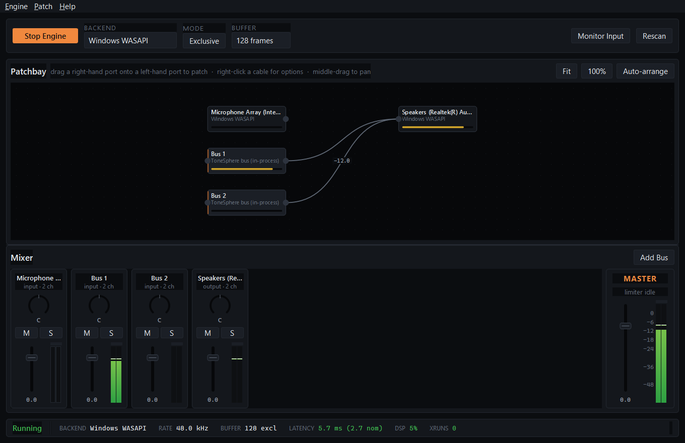

# Tone Sphere


Low-latency audio routing, mixing and VST3 hosting. On Windows the audio runs on a native
real-time engine — C++ behind a C ABI, with WASAPI and ASIO backends and a VST3 host —
driven by a Python control plane. Linux and macOS run the same application on a PortAudio
host. Every latency figure is labelled for what it is, and a figure nobody measured reads
`--`.

[](https://github.com/AvishakeAdhikary/tone-sphere/releases/latest)
[](LICENSE)
[](https://github.com/sponsors/avishakeadhikary)
[](https://www.patreon.com/avishakeadhikary)
[](https://ko-fi.com/avishakeadhikary)
[](https://www.buymeacoffee.com/avishake69)



This is not your usual readme.

I am a guitarist, and I recently bought an audio interface, only to find out that playing or recording guitar requires me to pay again.
Honestly it was all cool and all, but I use Guitar Rig, which already is an expensive piece of software, not to mention the guitar itself is expensive enough, now I have a microphone and an audio interface.
But then comes the audio software bs that comes with it.
I was bored and frustated. I tried both Voicemeeter and Odeus Asio Link Pro.
Voicemeeter ran great, until it asked me to donate again and again, it felt a lot intrusive. I mean, why would I wait for 5 minutes if it is a donationware? Ffs it's donation ware, you either ask nicely or leave, not make people wait.
When I still waited, it became high latency out of nowhere. With VB audio cable of course.
Then I tried odeus asio link pro with asio. And honestly bro, wtf. That stuff was ancient and still no alternative to the date, it was an absolute chad.
But tbh I didn't like the approach, it was too complicated for beginners to grasp, to steep of a curve to just plug your guitar in to your audio interface and start playing.
I've had enough, so being a coder myself, I coded one on my own.

This project is all about that.

## Setup

```
pip install uv        # if you don't have it
uv sync --all-groups
uv run main.py gui
```

**Windows:** the native engine is built from source, once. It needs Microsoft's EWDK (a
mountable ISO, no installer and no admin) and Steinberg's two SDKs, which are fetched rather
than committed — [docs/BUILDING_WINDOWS.md](docs/BUILDING_WINDOWS.md) has the details:

```
uv run python scripts/fetch_sdks.py
uv run python scripts/build_native.py
```

Without it the application still runs, on the PortAudio host, and says so.

**Linux only:** the `sounddevice` package is a thin ctypes wrapper — unlike the
Windows/macOS wheels, the Linux wheel does not bundle PortAudio's shared library. Install
it from your distro first, or every audio feature reports `PortAudio library not found`:

```
sudo apt install libportaudio2      # Debian/Ubuntu
sudo dnf install portaudio          # Fedora
sudo pacman -S portaudio            # Arch
```

Check what your machine can do first:

```
uv run main.py test
```

That opens a real stream on your default output, plays a test tone, and reports PASS/WARN/FAIL
per capability with the engine's own timing, exiting non-zero if anything is broken. On the
development machine (Intel i7-1165G7, Realtek ALC257), WASAPI exclusive at 128 frames:

```
[INFO] Engine:           native (tonesphere_native abi=12 msvc=195035724 release); no Python on the audio thread
[INFO] Active backend:   Windows WASAPI
[INFO] Available:        Windows WASAPI, ASIO
[PASS] Hardware inputs:  2
[PASS] Hardware outputs: 2
[PASS] Stream open on Realtek HD Audio 2nd output (Realt
[PASS] Audio callback ran 279 times
[PASS] No callback errors
[PASS] No dropouts (xruns)
[INFO] Reported latency: 3.0 ms round trip (what the driver says, not timed)
[INFO] Measured latency: -- (needs a loopback path; not taken by this test)
[INFO] Nominal latency:  2.7 ms (buffer arithmetic only)
[INFO] DSP load:         0.2% mean
[INFO] Callback time:    mean 0.007 ms, p99 0.016 ms, worst 0.020 ms (timed on the audio thread)
[INFO] Worst-case load:  0.7% of the buffer period
[PASS] Audio-thread heap allocations: 0
[INFO] Buffer / rate:    128 frames @ 48000 Hz, exclusive=True
```

### Latency: nominal, reported, measured

Three different numbers, never interchangeable.

- **Nominal** is buffer ÷ sample rate — arithmetic about ToneSphere's own contribution.
- **Reported** is what the drivers say the open streams' input and output latency is, plus
  what the plugins report. It includes the driver's buffering, but it is still a claim.
- **Measured** means a signal was sent out, captured back and the delay timed. On Windows,
  Diagnostics → Measure plays a short sweep on an output and times its return on an input
  (GCC-PHAT, refusing any result below a confidence threshold). It needs a physical path —
  a loopback cable, or a microphone that hears the speaker. A measurement is shown as the
  round trip only at the sample rate and buffer it was taken at; until then, `--`.

The output's own loopback can be measured too, as a check of the method: on this laptop
that digital path is 61–65 ms in shared mode, repeatable within one device period. It is
recorded as what it is and never reported as the round trip. Measured round trips on the
development machine:

| Path | Round trip |
|---|---|
| Audio Array AI-04, output → 6.35 mm cable → input, WASAPI exclusive, 3 ms period | 17.92 ms (15.94 ms in 2 of 10 starts) |
| the same, WASAPI shared | 76.9 ms |
| the same, from an ASIO buffer switch through ASIO4ALL 2.22, 64 / 128 / 256 / 512 frames | 15.58 / 18.27 / 23.58 / 34.27 ms |
| the laptop's own speakers → its own microphone array (acoustic) | 74.60–75.90 ms, 9 of 10 runs, just above the confidence threshold |

An earlier version of this README called a driver-reported figure "measured"; it was not.

## What works

**The native engine (Windows).** An immutable, preallocated execution plan per routing
configuration, swapped live by one atomic exchange, run by one audio thread that never
waits, allocates, locks or logs. One device's clock drives the mix; every other device
crosses in through a wait-free ring and a drift resampler. Measured on the development
machine: a guitar chain (EQ, compressor, bus, delay, limiter) at 48 kHz / 256 frames costs
about 24 µs a block (p99 32 µs, 0.6 % of the period); a 30-minute soak with Surge XT on the
output — see [docs/REALTIME.md](docs/REALTIME.md) — and every hardware test read zero heap
allocations on the audio thread. Architecture: [docs/ARCHITECTURE.md](docs/ARCHITECTURE.md).

**Backends.** Native WASAPI: shared (with the low-latency IAudioClient3 period where the
driver offers it) and exclusive with format negotiation, raw mode to bypass the driver's
"enhancements", MMCSS "Pro Audio" threads; a rendered signal captured back through process
loopback arrives bit-exact ([docs/WINDOWS_AUDIO.md](docs/WINDOWS_AUDIO.md)). Native ASIO, verified against FlexASIO
and ASIO4ALL, both driving a USB interface whose output is heard through a cable at the
level native WASAPI gives ([docs/ASIO.md](docs/ASIO.md)). Devices that disappear while
running are marked failed, and when they come back the engine reopens them with their
routes, on its own. The PortAudio host keeps WDM-KS, DirectSound and MME on
Windows as a fallback, and provides ALSA and JACK on Linux and CoreAudio on macOS.

**VST3 plugins (Windows).** A native host on Steinberg's VST3 SDK: a browser that scans each
module in a separate process (a module that crashes while loading takes down the scanner,
not ToneSphere) and lists every failure with its reason; insert chains on any device's
input or output; parameters, the host's bypass and the plugin's own editor; plugin state
and chains saved in presets. A plugin that faults on the audio thread is bypassed from that
block on and reported. Proven bit-exact with ToneSphere's own test plugin, and with
**Surge XT** measured end to end (its 250 ms delay heard at 250.06 ms)
([docs/VST3.md](docs/VST3.md)). Instruments too: a VST3 instrument gets a bus of its own
and is played by MIDI — from a MIDI input port, an on-screen keyboard, the REST API or the
CLI — through a fixed-size native queue; Surge XT and Dexed play in tune. Plugins and
insert chains can be driven entirely from the REST API and the CLI.

**Mixing.** Pan on routes (constant power for a mono source, balance for stereo), balance
on stereo strips, polarity invert, per-channel trim/mute/solo, channel swap, gain smoothing
on everything so nothing clicks, and a limiter on each output so a routing mistake sounds
like a compressed mix rather than a burst of digital noise. Meters per channel and per
side of a device; an output's meter reads exactly what the device was given.

**Effects.** Biquad EQ (peaking, shelves, high/low pass), a compressor with real attack,
release, knee and makeup, a limiter, and a delay with feedback — native on Windows, equal
to the Python reference within 2e-6, and in the Inserts dialog in one chain with VST3
plugins, on any device or bus. A 100 ms delay set there comes back through the AI-04's
cable at 100.000 ms.

**Diagnostics.** Callback min/mean/p99/max from the audio thread, worst block against its
own period, mean load, xruns, ring under/overruns, audio-thread allocations, and latency
broken into its nominal, reported, plugin and measured parts.

**Patchbay.** Drag a port to a port to connect. Feedback loops are refused before they
happen. Cables show their gain; muted and broken routes look different.

**Presets.** Patch, mixer and plugin state saved as plain YAML, keyed on stable device
identifiers (with names as a fallback), so they survive plugging something in. Partial
recall: a preset saved with an interface attached loads without it and tells you what was
missing.

**Settings.** Stored in SQLite under your user data directory —
`%LOCALAPPDATA%\Neural Nexus Studios\ToneSphere\settings.db` on Windows,
`$XDG_DATA_HOME/ToneSphere` (or `~/.local/share/ToneSphere`) on Linux,
`~/Library/Application Support/ToneSphere` on macOS. Not next to the executable: the Store
build is an MSIX package whose install directory is read-only, and the GUI and the API
server are expected to be open at once, which one YAML file cannot survive.
`config/default_config.yaml` holds the defaults, and every key in it is read by something.

**Network streaming, both directions.** A realtime UDP transport with a 30-byte binary
header, sequence numbers, and a jitter buffer that sizes itself to the measured delay
spread (no packet lost under ±15 ms of jitter where a fixed 10 ms buffer lost a third);
TCP both ways, with flow control rather than drops; and Opus compression through libopus
(161 bytes per 10 ms against 3,840 of PCM, 40 dB SNR on a tone, losses concealed by Opus
itself). Proved by tests that put a 1 kHz sine into a bus on one engine and read it back
out of a bus on another.

**Whole-system loopback.** Every output is also a source, "<output> (loopback)": whatever
Windows plays on it, routable like a microphone. Two other programs playing into the AI-04
at 0.1 and 0.05 came back at exactly 0.1000 and 0.0500. Feeding a loopback back into its
own output is refused before it can howl.

**Per-application capture, on Windows.** Capture one process's audio by PID — process
loopback, Windows 10 build 20348+, no driver and no virtual cable. Proved by capturing
ToneSphere's own process while it plays a known 1 kHz tone and measuring the frequency and
sample rate that come back.

**Virtual cables on Windows (in a test VM).** A kernel driver publishes up to eight
cables, each a render endpoint and a capture endpoint joined inside the driver: "Speakers
(ToneSphere Cable 1)" into "Microphone Array (ToneSphere Cable 1)", and so on. A fresh
install creates two. Engine → Virtual Cables… adds, renames, disables, enables and
uninstalls each one, or removes the driver, through Windows' own UAC prompt. Each cable is
its own device, so disabling one leaves the others playing. See "What does not work yet"
for why it is not something you can install today.

**A Linux sink other applications can select.** A `pactl`-created null sink, bridged into
PortAudio through an ALSA `pulse` PCM, so routing into it is an ordinary output stream.
Routing a device through a bus to another device works on the PortAudio host too — proven
through a real PulseAudio server in WSL2 and in CI.

**Threads.** Every engine object takes one lock on every public method, the Qt window
never waits on the engine (actions run on an ordered worker, meters on a poller), and the
REST handlers run in a threadpool. A storm test of eight threads on one engine finds a race
within a second with the locks taken out, and none with them in.

**Also:** real audio-session detection (which applications are actually playing), a REST
API with a WebSocket stats feed, a CLI, and an interface in English and (machine-translated,
marked as such) Hindi.

## What does not work yet

- **Virtual cables anyone can install.** The Windows cables work in a Hyper-V test VM:
  they install, Windows enumerates them, audio crosses between programs at exactly the
  level sent (ffmpeg records one through DirectShow), each cable is isolated from the
  others, and they are added, renamed, disabled, re-enabled and uninstalled from the UI.
  But the driver is test-signed, so it loads only where test-signing is on, and it cannot
  be offered to anyone until Microsoft signs it, which needs an EV certificate this project
  does not have. It has not been tried on a real desktop with Discord or OBS
  ([docs/VIRTUAL_AUDIO_DRIVER.md](docs/VIRTUAL_AUDIO_DRIVER.md)).
- **An interface manufacturer's ASIO driver.** The ASIO host is verified against FlexASIO
  and ASIO4ALL — genuine ASIO drivers, but third-party wrappers over WASAPI and WDM-KS. The
  Audio Array AI-04's maker publishes no ASIO driver, and no other interface was available.
- **Commercial plugins, AU, and plugin isolation.** No commercial plugin (Guitar Rig,
  Neural DSP, ...) has been tested, and nothing is claimed about them. Neural Amp Modeler
  was not tried, because its installer is unsigned. AU is not supported. Plugins run in
  ToneSphere's process: a fault on the audio thread is caught and the plugin bypassed, but
  a plugin can still take the application down.
- **MIDI from a hardware keyboard.** MIDI input ports are opened and forwarded to
  instruments, but no MIDI device was available to test it; the on-screen keyboard, REST
  and CLI paths are tested.
- **macOS, beyond CI.** There is a real CoreAudio HAL plug-in in
  [native/coreaudio-plugin/](native/coreaudio-plugin/) that publishes a **ToneSphere Audio**
  loopback device. It **builds, installs, and round-trips audio in the macOS CI job** — a
  1 kHz sine written to the device and captured back from it, with the frequency and RMS
  asserted. That is the whole of the evidence. Day-to-day device-picker behaviour, and
  device → bus → device routing with real macOS devices, are **unverified**: nobody on the
  project owns a Mac. That is left for someone who does.

What is proven, and at which level, is tracked item by item in
[docs/IMPLEMENTATION_STATUS.md](docs/IMPLEMENTATION_STATUS.md).

## Roadmap

| Phase | | |
|---|---|---|
| 0 | Remove false claims, delete dead code, add tests and CI | done |
| 1 | Real audio I/O: PortAudio callback, lock-free graph, real enumeration | done |
| 2 | Real mixer: pan law, polarity, limiter, drift resampling, metering | done |
| 3 | Qt interface: mixer strips, dB faders, node-graph patchbay | done |
| 4 | Real DSP, honest app detection, presets; VST3 hosting (native, phase 6) | done |
| 5 | Packaging (CI-built and smoke-tested, releases on tag); per-process capture (Windows, done); virtual devices (Linux done; macOS proven in CI, unverified in daily use; Windows: see phase 6); Microsoft Store MSIX — manifest, logo generation and a local pack script exist and the manifest validates against the real `makeappx`, but nothing has been signed, installed from a package, or submitted, and the Store identity does not exist yet (see [docs/MICROSOFT_STORE.md](docs/MICROSOFT_STORE.md)) | mostly done |
| 6 | Windows-native real-time engine: C++ audio path behind a C ABI (done), native WASAPI (done), ASIO (done; verified against FlexASIO and ASIO4ALL on a USB interface), VST3 host (done; effects and instruments, from the UI, REST and CLI), measured round trip (done; through an interface's cable and acoustically), Windows virtual cables (done in a test VM: several, each managed from the UI; production signing unavailable) — step by step in [docs/IMPLEMENTATION_STATUS.md](docs/IMPLEMENTATION_STATUS.md) | mostly done |
| 7 | Closing the gaps: threads, devices that come and go, whole-system loopback, built-in effects in the UI, TCP send, adaptive jitter buffer, Opus, bus routing on the PortAudio host | done |

## A note on how this was rebuilt

An earlier version of this README advertised ASIO, WASAPI, ALSA, PulseAudio, JACK, PipeWire
and CoreAudio support, virtual audio devices, real-time effects and low-latency processing.
None of it worked. The eight driver classes each returned an array of zeros instead of
talking to an audio API; the "virtual audio devices" were Python queues; routing reported
success into an empty registry; and the UI displayed `CPU: 0% | Latency: 0ms` permanently,
which was not a reading of anything.

So there is one rule here now, and the test suite enforces it:

> **A feature does not exist until a test proves it moves audio.**
> And a measurement you did not take is reported as `--`, never as `0`.

That second half matters more than it sounds. `0.0` renders as a real, healthy-looking
number. Rendering `--` is the difference between a UI that tells you what it knows and one
that tells you what you want to hear.

## Sponsor

Everything here is free, and it stays free. No feature is time-limited, no dialog waits five
minutes before letting you through, and nothing is held back until you pay — the whole reason
this project exists is that I got tired of exactly that.

If it replaced something you would otherwise have had to buy, you can put that toward the
next release:

- **GitHub Sponsors** — [github.com/sponsors/avishakeadhikary](https://github.com/sponsors/avishakeadhikary)
- **Patreon** — [patreon.com/avishakeadhikary](https://www.patreon.com/avishakeadhikary)
- **Ko-fi** — [ko-fi.com/avishakeadhikary](https://ko-fi.com/avishakeadhikary)
- **Buy Me a Coffee** — [buymeacoffee.com/avishake69](https://www.buymeacoffee.com/avishake69)

It buys no feature and no priority. It buys time to work on this.

## Legal

Published by **Neural Nexus Studios**, Kolkata, West Bengal, India. No accounts, no telemetry,
nothing collected — the one thing that sends audio off your machine is the optional network
stream, and only when you set it up yourself.

- [Terms and Conditions](docs/legal/terms-and-conditions.md) — use of the application itself.
- [Terms of Service](docs/legal/terms-of-service.md) — what it provides, support, updates,
  the optional network feature, Microsoft Store distribution.
- [Privacy Policy](docs/legal/privacy-policy.md) — what stays local, and the one exception.

The same three are published as a site at
[avishakeadhikary.github.io/tone-sphere](https://avishakeadhikary.github.io/tone-sphere/),
which is the address to hand to the Microsoft Store as the privacy policy URL.

## Licence

ToneSphere's own source is [MIT](LICENSE). Use it, change it, ship it, sell it — keep the
copyright and permission notice, and don't imply that a build you changed is the official
one or that it comes from us.

**The Windows executable on GitHub is GPLv3.** Its ASIO support, `tonesphere_asio.dll`, is
built from Steinberg's ASIO SDK under GPLv3 ([native/asio/](native/asio/) is GPLv3 for that
reason), so a build that bundles it is distributed under GPLv3 as a whole. Each Windows
release carries its Corresponding Source, SDKs included, as `ToneSphere-windows-source.zip`.
The Microsoft Store package leaves ASIO out and is MIT alone, as are the Linux and macOS
executables ([why](docs/MICROSOFT_STORE.md#7-licensing-the-store-package-does-not-carry-asio)).
ToneSphere is free today; later versions or editions may be paid, and a copy you already
have keeps its licence (Terms and Conditions, section 3). The virtual audio driver in
[driver/windows_virtual_audio/](driver/windows_virtual_audio/) is Microsoft's sample under
the MS-PL. The Terms and Conditions above only add what a licence does not speak to, and
cannot narrow either licence — see their section 3.

## Contributing

Contributions welcome, under the MIT Licence with a DCO sign-off ([CONTRIBUTING.md](CONTRIBUTING.md)). Run the tests with `uv run pytest -m "not hardware"` (what CI runs),
the hardware suite with `uv run pytest -m hardware` before trusting any change to the audio
path, and lint with `uv run ruff check .` — CI runs on every push and PR, across Windows,
Linux and macOS, building the native engine on Windows first. [AGENTS.md](AGENTS.md) holds
the project's rules and [docs/TESTING.md](docs/TESTING.md) how "it works" is established.

If you add a backend, an effect or a control, add a test that asserts a known signal comes
out the other side at the expected amplitude. Several real bugs in this rebuild — a filter
that diverged to infinity, a fan-out that silently dropped one destination, a limiter whose
attack time was wrong by a factor of 256, a pan knob that moved nothing — were caught by
exactly that kind of test and by nothing else.

P.S. This is not a rickroll.
Executables now build and get smoke-tested in CI on all three platforms, and publish to
GitHub Releases once a version tag is pushed. Still busy working in corporate. Inviting
others to contribute.
Have fun.
