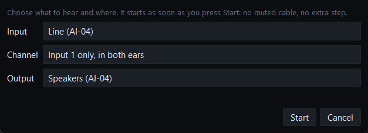
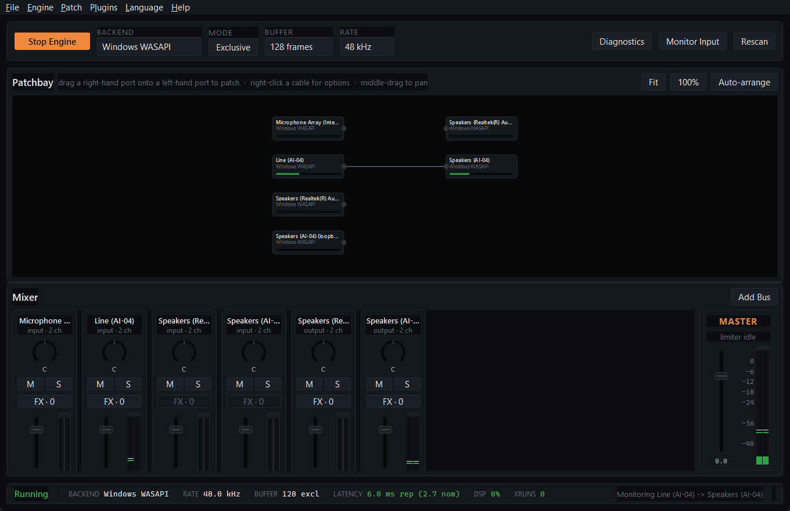
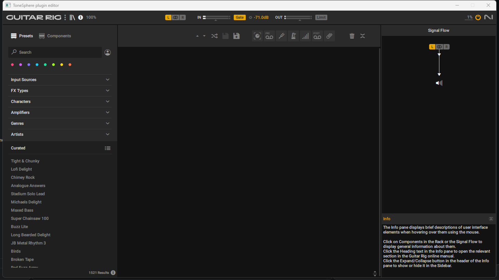
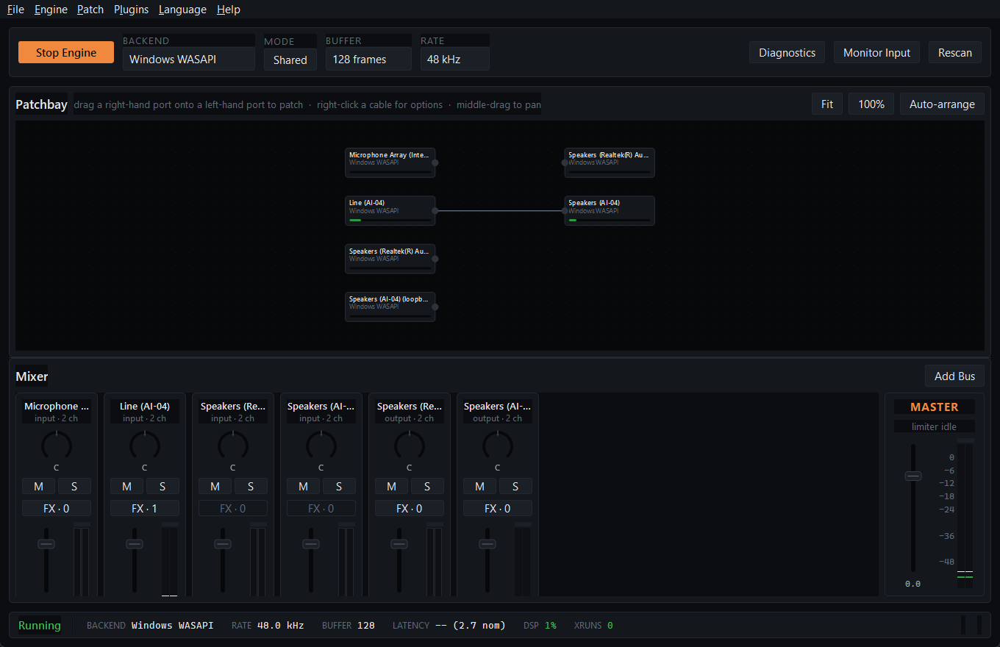
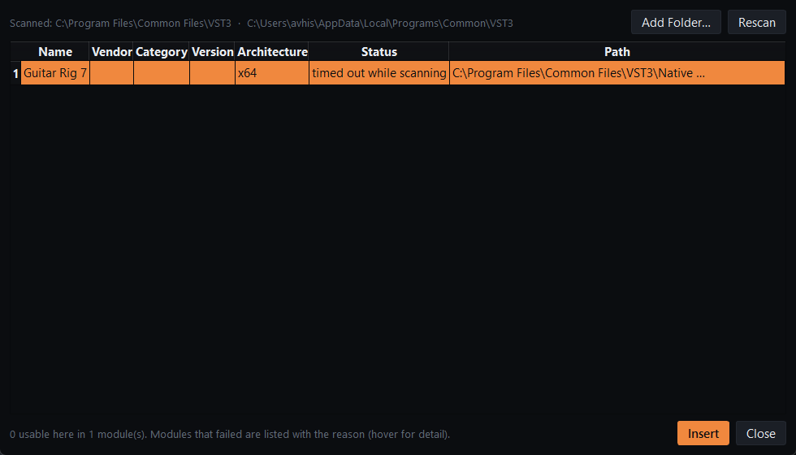

# First-run verification

v0.2.0 passed every test it had and still failed its owner on a clean machine: the exe
opened no window, Monitor Input moved the meters and played nothing, Guitar Rig was
"crashed while reading", and cables did not play. The tests drove the code; none of them
drove the product someone downloads. This is the record of doing that: the release build
installed and used through its own window, with a guitar plugged in, and what reached the
headphones measured from outside the application.

## Setup

| | |
|---|---|
| Date | 2 October 2026 |
| Machine | the development laptop (Intel i7-1165G7), Windows 11 Pro 26200, Secure Boot off, test-signing off, no ASIO driver installed |
| Interface | Audio Array AI-04 (USB, Windows' class driver): a guitar on input 1, headphones on its output |
| Build | `ToneSphere-0.2.1-Setup.exe` from CI run 36973575789 (commit `074451f`), downloaded as a run artifact |
| Plugin | Native Instruments Guitar Rig 7.0.1, installed by the owner |
| Driving the window | Windows UI Automation from PowerShell (`System.Windows.Automation`): every click, choice and slider move went through the app's own controls |
| Measuring | `tests/hardware/first_run_probe.py`, a separate process: it captures the AI-04's input and its output's loopback (exactly what ToneSphere hands the headphones) in shared mode and compares them — level, dominant frequency, and the correlation of each ear with input 1 |

The guitar was not played; its pickups' 50 Hz hum at about −49.6 dBFS was the signal. That
is enough to identify it in the output (a correlation of 0.9 and more) and to measure levels.

## What happened

**Installing.** The installer, started through Explorer as a double-click starts it, ran
its wizard without an administrator prompt (destination `%LOCALAPPDATA%\Programs\ToneSphere`),
created a Start menu shortcut, and on Finish started ToneSphere. The process ran
**non-elevated** (token elevation 0; the shell that drove it was elevated, 1). A downloaded
copy carries the Mark of the Web, and SmartScreen then asks first; a CI artifact fetched
with `gh` does not, so that prompt did not appear here. It was reproduced on 1 October with
a marked copy of v0.2.0, and is what the owner took for an elevation request.

**First window.** With no session yet, the engine started by itself on Windows WASAPI,
exclusive, 128 frames at 48 kHz. The backend list showed "ASIO — no ASIO driver installed",
disabled.

**Monitor Input.** The dialog preselected the interface over the laptop's own devices:



Start: the cable appeared, the status bar said `Monitoring Line (AI-04) -> Speakers (AI-04)`,
`128 excl`, and latency `6.0 ms rep (2.7 nom)` — reported and nominal, labelled so; nothing
had measured a round trip, and nothing claimed to.



An exclusive stream locks other programs out of the device, the probe included, so the mode
button was pressed (it now reads **Shared**) and the output measured:

| | Input 1 | Left ear | Right ear | Ear − input | Correlation with input 1 |
|---|---|---|---|---|---|
| Monitoring | −49.62 dBFS, 50.0 Hz | −52.50 dBFS, 50.0 Hz | −52.50 dBFS | **−2.88 dB** | 0.941 |

One input channel to both ears at constant power puts each ear 3.01 dB below the input.

**Guitar Rig.** FX on the Line (AI-04) strip → Add… opened the plugin browser, whose first
scan **timed out after 120 s** — a defect, below. Rescan read it in 2.0 s. Insert put it on
the input, live; its parameters were read back from it, and its Rack Master Volume, moved
from the parameter list, displayed `+0.0dB`, then `-12.0dB`.

| | Input 1 | Each ear | Ear − input | Change | Correlation |
|---|---|---|---|---|---|
| Guitar Rig at −12.0 dB | −49.61 dBFS | −64.74 dBFS | −15.13 dB | **−12.25 dB** | 0.903 |

Its editor opened inside ToneSphere and closed cleanly:



**Closing and reopening.** The window was closed with its close button's message; the session
was written (`session.yaml`: the route with input channel 0, shared mode, Guitar Rig with its
state). Started again from the Start menu shortcut, it came back running, in Shared mode,
with the cable and FX · 1, playing:

| | Input 1 | Each ear | Ear − input | Correlation |
|---|---|---|---|---|
| After reopening | −49.59 dBFS | −64.62 dBFS | **−15.03 dB** | 0.967 |



The same run against the locally built app, earlier the same day, gave −3.02 dB monitoring,
−12.20 dB for Guitar Rig's −12.0 dB, and −15.05 dB after reopening.

## Defects this found, and what became of them

| Found | Cause | Fixed by |
|---|---|---|
| A Guitar Rig setting changed while the plugin was not processing was missing from its saved state | VST3 hands a change to the processor only in `process()`, and the plugin saves what its processor has | The host flushes queued changes with a zero-sample `process()` before reading state when no audio thread holds the instance; `test_a_change_made_while_nothing_processes_is_in_the_saved_state` |
| After a shared-mode session was restored, the mode button still said Exclusive | The button started checked and was never synced from the engine | It follows the engine, and its text is the state; `test_the_mode_button_shows_the_mode_the_engine_is_in` |
| The disabled ASIO entry was drawn like a choice | The style sheet's popup ignores the disabled state | Dimmed explicitly; asserted in the window test |
| Guitar Rig's first scan in the installed build timed out at 120 s | The scanner wrote its result and then hung in Guitar Rig's DLL detach on exit: `os._exit` still runs it on Windows. Reproduced with the installed scanner: the first of five runs hung after writing its result, the other four left in 1.9–2.0 s | The scanner terminates itself outright, and the parent ends a child that has reported but not left within 5 s; `test_a_scanner_that_hangs_after_reporting_is_ended_and_believed`. The same cause explains a skipped hardware test earlier that day |



## What this does not show

- **The crash report from the built app.** No fault reachable through the interface was
  found to trigger it — even a data folder that cannot be written leaves the app running.
  The report and its dialog are proven by `TestAFailureLeavesAReport`, which raises through
  the installed hook.
- **Discord.** It played nothing while this ran and its window exposes nothing to UI
  Automation, so it was not captured. Per-application capture itself is HARDWARE VERIFIED
  (`TestSelfCapture`). ToneSphere as Discord's microphone needs the virtual cable, which by
  the owner's decision is installed only in a test VM until it can be signed.
- **SmartScreen and Gatekeeper.** Not avoidable without code signing; the release notes
  say what to click.
- **Linux and macOS.** Their downloads are launched by CI (the AppImage, the app from the
  `.dmg`), with a window and a backend asserted; nobody used them with an instrument.
- **Latency.** Not measured here: there was no cable from the output to an input.

## Repeating it

`tests/hardware/test_first_run.py` repeats the measured part without the clicks: it starts
the built app (`dist/ToneSphere`, or `TONESPHERE_APP`) on a prepared session — the monitor
route, then the route with Guitar Rig at −12 dB — and runs the probe.

```
uv run pyinstaller --noconfirm tonesphere.spec
uv run pytest tests/hardware/test_first_run.py tests/hardware/test_guitar_rig.py -m hardware -s
```
